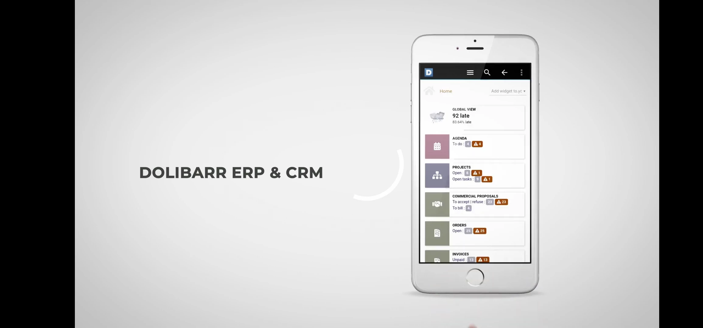

# DOLIDROID, THE ANDROID CLIENT FOR DOLIBARR ERP & CRM

## TITLE
DoliDroid is the Android front-end client for Dolibarr ERP & CRM web software.

## DESCRIPTION
This application is not a standalone program. It is a front end client to use a your online hosted instance of Dolibarr ERP & CRM software (Open-source web software to manage your business, see https://www.dolibarr.org).
DoliDroid rewamps your Dolibarr web installation, so all your online existing features are supported by this application. This is also true for external modules features.

The advantage of DoliDroid are :
- DoliDroid provides a menu system easier to use than the native web application.
- DoliDroid use embedded image resources of your version, when available, to reduce bandwidth usage.
- DoliDroid use internal cache for pages that should not change during session (like menu page)
- Connections parameters (login/password) are saved. No need to enter them each time you use DoliDroid.
- Integration with your phone or other applications is better (Clicking on a PDF opens the PDF reader, clicking onto email or phone launch your email application or launch Android dialer, ...)
- The forms for uploading an image include the possibility of taking a picture of the image directly from the Dolibarr forms.
- A lot of other enhancement make usability of your Dolibarr from a smartphone better like:
* Save spaces of the menus bars by replacing the menu with a button always visible to choose your meny entry more friendly.
* Provide a button, always available, to make a quick search on any item.
* All visible date use year on 2 chars instead of 4 to save you space.
* When the popup calendar is opened, the keyword is no more opened if not required like it is on a common browser.
* Components that provide help information on mouse hover are hidden to save space (they are useless without a mouse).
* A lot of other not useful information are hidden.
- DoliDroid is an Open Source project (licence GPLv3)

WARNING ! 

This application need Android 6.0+ and a hosted Dolibarr ERP & CRM version 9 or newer, accessible by internet
(For example, when hosted on any SaaS solution like DoliCloud - https://www.dolicloud.com).
