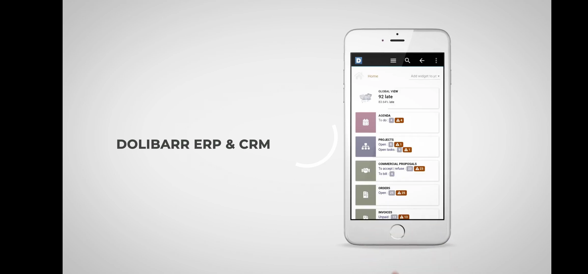

# DOLIDROID, LE CLIENT ANDROID POUR DOLIBARR ERP & CRM

## TITLE
DoliDroid est un client Android du logiciel web Dolibarr ERP & CRM (en français PGI & GRC).

## DESCRIPTION
DoliDroid n'est pas un programme autonome. C'est un logiciel client qui accède à une instance, hébergée en ligne, de votre logiciel OpenSource Dolibarr ERP & CRM (logiciel de gestion de votre activité professionnelle, voir https://www.dolibarr.org).
C'est une interface qui se superpose à une installation web existante, aussi, toutes les fonctionnalités existantes sont prises en charge. Ceci est également vrai pour la plupart des modules externes. DoliDroid reste compatible après une mise à jour de Dolibarr.

Voici les avantages de DoliDroid :
- DoliDroid fournit une gestion de menu plus simple d'utilisation que le menu natif.
- DoliDroid améliore la performance du réseau en utilisant les ressources images embarquées de votre version, quand c'est possible, ce qui réduit fortement la consommation de votre bande passante.
- DoliDroid met en cache les pages non susceptible de bouger (comme la structure du menu par exemple ou la page de recherche)
- Les paramètres de connexion (login/mot de passe) sont conservés, pas de besoin de les entrer à chaque fois.
- Intégration avec les fonctions ou autres applications de votre téléphone (Cliquer sur un PDF ouvre votre lecteur PDF, cliquer sur un email ou numéro de téléphone lance l'application adéquate ou le composeur de numéro de votre Android, ...)
- Les formulaires pour téléverser une image intégre la possibilité de prendre en photo l'image directement depuis les formulaires Dolibarr.
- De nombreuses autres améliorations rendent l'usage de Dolibarr avec un téléphone beaucoup plus agréable comme par exemple:
  * Mise à disposition du menu haut et gauche dans une liste déroulante toujours accessible au sein du menu de l'application
  * Ajout d'un bouton, toujours disponible, pour une recherche rapide sur tout type d'objet.
  * Toutes les date visible ont une année sur 2 caractère au lieu de 4 pour sauver de l'espace.
  * Quand la popup d'un calendrier est ouverte, le clavier ne s'ouvre plus si ce n'est pas nécessaire, comme avec une navigation classique.
  * Les composants qui fournissent des informations d'aide sur passage de la souris sont cachées pour économiser de la place (ils sont inutiles sans souris).
  * De nombreuses autres informations inutiles et génantes sur de petis terminaux sont cachées.
- DoliDroid est un logiciel OpenSource (Licence GPLv3)

ATTENTION !

Cette application requiert Android 6.0+ ainsi q'un Dolibarr ERP & CRM hébergé en version 9 ou plus et accessible par internet (comme, par exemple, lorsque vous êtes hébergé par l'offre SaaS DoliCloud - https://www.dolicloud.com)
